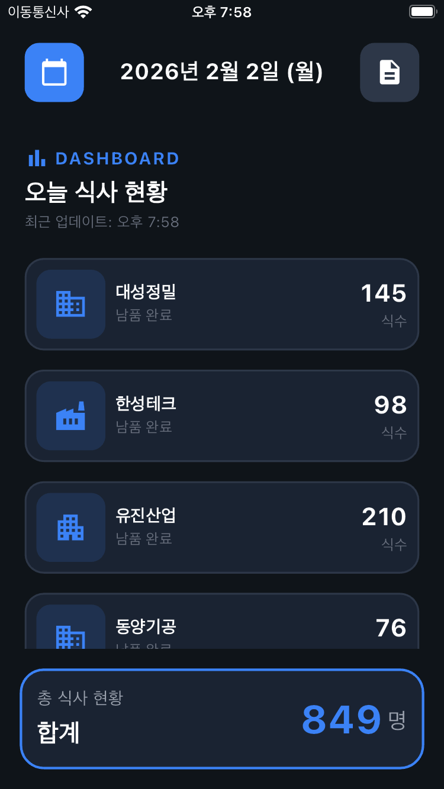
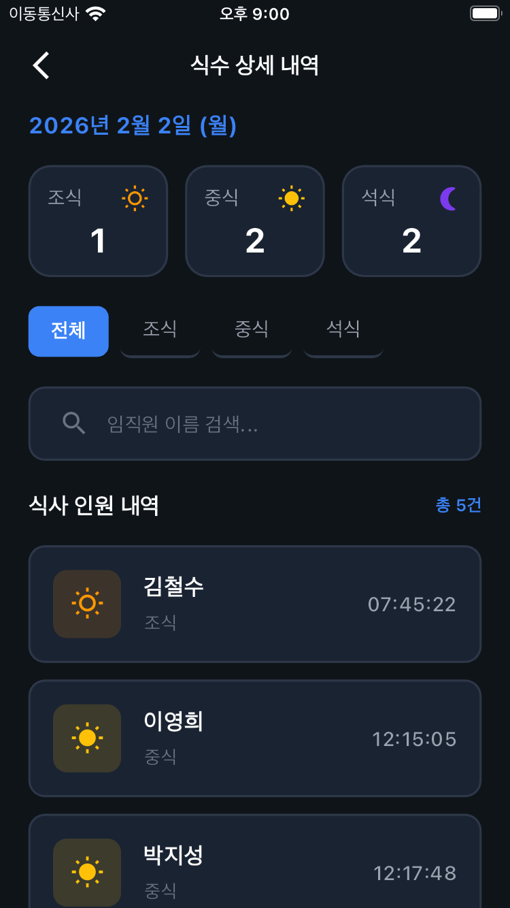
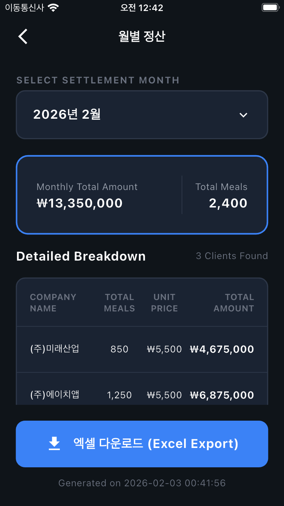

# 공밥 사장님용 앱 (Gongbab Owner)

공밥 사장님 전용 앱입니다. 사장님들은 이 앱을 통해 일일 식사 현황, 업체별 식사 내역, 월별 정산 등을 확인할 수 있습니다.

## 스크린샷 (Screenshots)

| 로그인 | 홈 | 상세 |
| :---: | :---: | :---: |
|  |  |  |
|  |  | |

## 주요 의존성 (Dependencies)

- `cupertino_icons`: ^1.0.8 (iOS 스타일 아이콘)
- `go_router`: ^15.1.2 (내비게이션)
- `flutter_screenutil`: ^5.9.3 (반응형 UI)

---

## Getting Started

This project is a starting point for a Flutter application.

A few resources to get you started if this is your first Flutter project:

- [Lab: Write your first Flutter app](https://docs.flutter.dev/get-started/codelab)
- [Cookbook: Useful Flutter samples](https://docs.flutter.dev/cookbook)

For help getting started with Flutter development, view the
[online documentation](https://docs.flutter.dev/), which offers tutorials,
samples, guidance on mobile development, and a full API reference.